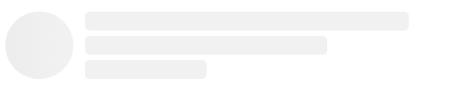

# React Skeleton Builder

A lightweight React component library for building skeletons with TypeScript and Chakra UI.


## Installation
``
npm i react-skeleton-builder
``

## Usage

### In the root of your providers
```
import { ReactSkeletonProvider } from 'react-skeleton-builder';

<ReactSkeletonProvider
    value={{
        // Initialy we can put empty object.
        // Check the props to customize the builder's behaviour
    }} 
>
    {children}
</ReactSkeletonProvider>
```
### Example of Skeleton Component
You can generate the grid structure by visiting the
[website](https://skeleton-generator.vercel.app/).

````
import React from 'react';
import { Skeleton } from 'react-skeleton-builder';

const ExampleComponent: React.FC = () => {
return (
<Skeleton
    styles={{
        width: '100%',
        height: '60px',
    }}
    grid={{
        children: [
            {
                w: '60px',
                skeletons: [
                    {
                        h: '60px',
                        r: '50%',
                    },
                ],
            },
            {
                direction: 'column',
                gridGap: '.5',
                skeletons: [
                    { r: '.4rem', w: '80%' },
                    { r: '.4rem', w: '60%' },
                    { r: '.4rem', w: '30%' },
                ],
            },
        ],
    }}
    />
);
};

export default ExampleComponent;
````

### The result is this:


# API
### Props of ReactSkeletonProvider
| Props    | type                             | required | defaultValue |
|----------|----------------------------------|----------|--------------|
| children | ReactNode                        | true     |              |
| value    | Object (check appropriate table) | true     | {}           |
<br />

### value prop consist of these:
| Props             | type                             | required | defaultValue                      |
|-------------------|----------------------------------|----------|-----------------------------------|
| isDark            | boolean                          | false    | false                             |
| colorTheme        | Object (check appropriate table) | false    | DEFAULT_COLOR_THEMES              |
| breakpoints       | Object (check appropriate table) | false    | DEFAULT_BREAKPOINTS               |
| skeletonAnimation | string                           | false    | SKELETON_ANIMATION_VARIANTS.SLIDE |
<br />

### colorTheme prop consist of these:
| Props | type                                    | required | defaultValue                             |
|-------|-----------------------------------------|----------|------------------------------------------|
| dark  | Object {main: string, gradient: string} | true     | { main: '#282c34', gradient: '#2c303a' } |
| light | Object {main: string, gradient: string} | true     | { main: '#f1f1f1', gradient: '#ececec' } |
<br />

### breakpoints prop consist of these:
| Props   | type   | required | defaultValue |
|---------|--------|----------|--------------|
| mobile  | string | true     | 576px        |
| tablet  | string | true     | 961px        |
| desktop | string | true     | 962px >      |

<br />

If you encounter any issues, please visit this [link](https://github.com/ASahak/skeleton-generator/issues).

If my builder was helpful for you, you can show your support by

[](https://buymeacoffee.com/asahak)


### You can reach out to me via:
- **[Telegram](https://t.me/A_Sahak)**
- **[Linkedin](https://www.linkedin.com/in/arthur-sahakyan-276abb158/)**

### And thanks for using my builder :)